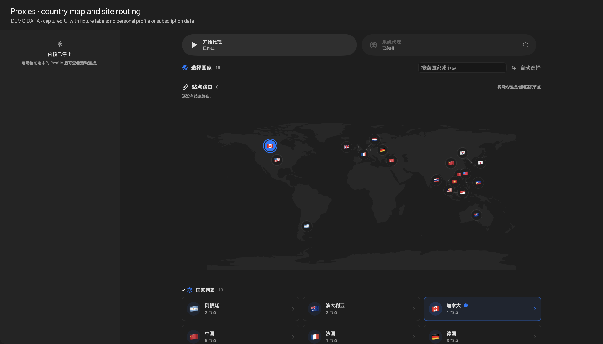

<p align="center">
  
</p>

<h1 align="center">Target</h1>

<p align="center">
  把代理变成一个安静、可解释的 macOS 工作台。
</p>

<p align="center">
  <a href="README.md">简体中文</a> · <a href="README.en.md">English</a> · <a href="https://github.com/jason312928/Target/releases">下载</a>
</p>

<p align="center">
  
  
  
  
</p>

> [!IMPORTANT]
> Target 目前仍是 **Development Preview**，不是稳定版。最新预览版仅支持 Apple Silicon，使用 Apple Development 签名且尚未公证；macOS 可能要求你手动确认打开。

## 关于 Target

Target 是使用 Swift 与 SwiftUI 构建的原生 macOS sing-box 客户端。它把 Profile、节点、策略和运行状态放在同一个工作区里：你可以看见流量正在经过哪里，知道一次切换为什么发生，也能在需要时把控制权交还给自己。sing-box 以内核进程的形式在当前用户下运行，Target 只在用户明确连接时修改 macOS 系统代理。

## 现在可以做什么

- **一键进入连接状态**：Connect 启动 Target 管理的 sing-box 实例并建立系统代理；Disconnect 与 Restart 共享同一套安全生命周期。
- **Profile 是工作台，不是文件夹**：创建、导入、导出、复制、重命名和删除配置；用 JSON 高亮、格式化、诊断、版本历史和上一有效版本恢复来持续整理它。
- **让节点有一张地图**：在 Proxies 中按国家查看节点和路线，测试延迟，选择最低延迟的可用节点；还可以把网站拖到国家节点上，保存站点路由。
- **Smart Routing，给每次切换一个理由**：Smart Switch 根据近期健康、目标和网络证据为新连接收敛选择器，同时保留现有连接；Smart Apply 会先确认选择，再只处理证据充分、可安全替换的连接，受保护或不确定的连接会被保留。
- **订阅在本地变得可读**：直接读取公共 HTTPS 订阅，在本机完成格式识别、节点转换、`sing-box check` 和脱敏预览，不依赖第三方转换站。
- **诊断像一个小型控制室**：工作区侧栏展示活动连接，独立诊断窗口提供 Connections、Traffic、Logs；支持连接搜索、排序、暂停，查看流量历史和搜索日志。通过工具栏或 `⌘⇧D` 打开诊断窗口。
- **把 macOS 的日常入口接上**：菜单栏快速控制、首次使用引导、启动时运行、应用内更新，以及中英文界面。
- **需要脚本时也有同一套控制面**：随 App 提供 `targetctl`，通过本地控制平面管理 Profile、订阅、策略、Smart 操作、引擎、系统代理和运行状态。

这些 Smart 操作是用户主动触发的一次性动作，不会在后台悄悄改写选择；当运行证据不足时，Target 会选择保留连接并明确告诉你原因。

## 先看界面

下面这张图来自 Target 的实际 SwiftUI 界面。为了适合公开文档，Proxies 图裁掉了 Profile 标识，并在图头加入 `DEMO DATA` 说明；图片不包含真实订阅地址、节点凭据或本机路径。



*Proxies：把节点按国家铺在地图上，也可以从国家列表进入节点选择；站点路由区域支持把网站链接拖到国家节点。*

## 典型工作流

### 1. 把 Profile 变成可运行的配置

Profiles 工作区承接从“拿到一份 JSON”到“开始连接”的完整过程：

1. 新建 Profile，导入 JSON，或添加一个受支持的 HTTPS 订阅。
2. 在 Configuration 中编辑 JSON；编辑器提供语法高亮、格式化和错误定位。
3. 保存前与启动前都运行 `sing-box check`。校验失败时，上一份有效版本继续保留。
4. 通过版本历史查看变更，需要时恢复上一有效版本，再回到 Overview 或 Proxies。
5. 在 Dashboard 或 Profile 工作区启动内核；系统代理可以单独启用或关闭。

Profile 的长期存储使用 macOS Keychain 管理的认证加密，导入、导出、复制、重命名和删除也都从同一个 Profile 操作菜单完成。

### 2. 用 Proxies 选择节点，而不是翻一长串标签

Proxies 页面把 selector 变成可读的选择空间：地图显示参与 Profile 聚合的国家，国家列表显示节点数量，搜索框同时筛选国家和节点。选择国家时，Target 会优先选择该国家中已测速且可用的最低延迟节点；也可以展开国家卡片，直接选择具体节点。

每个 selector 都会显示运行状态：选择已保存但尚未应用时，会明确提示需要 Apply 或 Restart；运行环境不可用时，页面会把原因显示在选择器附近。点按 `Automatic` 可以恢复 Profile 中的默认选择。

站点路由是另一层持久化选择：把一个网站 URL 拖到国家节点，Target 保存域名到国家/节点的绑定；绑定节点失效时会标记为不可用，不会静默指向另一个未知节点。

### 3. Smart Routing 的两种明确动作

Smart 目前是 Proxies 页面里的显式菜单，不是后台循环任务。两种动作分别处理“新连接怎么走”和“已有连接要不要动”：

| 动作 | 做什么 | 连接策略 |
| --- | --- | --- |
| **Smart Switch** | 结合近期健康、目标、网络状态和历史惩罚，给当前 selector 一个可解释的推荐并应用 | 只影响新连接，已有连接继续保持 |
| **Smart Apply** | 先完成 selector 收敛，再检查连接的运行证据与连续性 | 只关闭逐条确认、低风险且可替换的连接；受保护或不确定的连接保留 |

如果证据不足，界面会显示“需要更明确的运行证据”或“保留现有连接”，而不是为了追求切换结果强行重启整个内核。Smart 的操作结果还会告诉你 selector 是否改变、关闭了多少条连接、保留了多少条连接。

脚本也使用同一套应用操作：

```sh
targetctl smart shadow --json       # 只观察，不改变选择
targetctl smart apply --json        # 应用一次 Smart Switch
targetctl smart continuity --json   # 读取连接连续性分类
targetctl smart continuity apply --json
```

### 4. 订阅导入先预览，再保存

订阅操作分成下载、识别、转换、校验、预览、确认六步。Target 不把原始订阅直接塞进 Profile，而是在本机生成受限的 sing-box 配置，并展示节点数量、支持的协议、跳过的协议和兼容性警告。

当前支持 sing-box JSON、URI 列表、Base64 URI 列表和 Clash/Mihomo YAML；节点转换覆盖 Shadowsocks、VMess、VLESS、Trojan、AnyTLS。SSR、Hysteria2/Hy2、TUIC 可以被识别并在仍有可用节点时跳过。服务商私有规则、代理组和 DNS 语义不会被假装成完整兼容。

### 5. 从 Diagnostics 看见运行时发生了什么

Diagnostics 是独立窗口，不会把运行日志塞进 Profile 编辑器：

- **Connections**：搜索目标、按最新连接/目标地址/流量排序，暂停或继续实时刷新；明细包含目标、网络、路由链和流量统计。
- **Traffic**：查看上传、下载与连接数量的时间变化，适合判断是单个节点变慢还是整体流量异常。
- **Logs**：按关键字筛选运行日志，定位启动、策略应用和系统代理状态变化。

工作区侧栏会保留一份轻量的活动连接摘要；完整诊断窗口可从工具栏或 `⌘⇧D` 打开。Target 对明细数量设置上限，避免诊断窗口把大量连接变成新的负担。

### 6. macOS 入口与自动化

Target 提供菜单栏快速控制、首次使用引导、Launch at Login 和 Sparkle 2 应用内更新。更新器使用固定 HTTPS appcast、EdDSA 签名校验，并保留现有 Profile、选择状态、普通偏好和 Keychain 加密身份。

`targetctl` 通过本地控制平面复用同一套应用操作，不另起一套 CLI 业务逻辑。除了 Smart 操作，还可以查询状态、管理 Profile、列出/选择策略、绑定站点路由、启动/停止引擎、控制系统代理和执行恢复：

```sh
targetctl status --json
targetctl profile list --json
targetctl policy list --json
targetctl route list --json
targetctl connect --json
targetctl proxy status --json
```

## 订阅兼容范围

Target 会先下载并验证候选内容，展示脱敏变化摘要，只有在你确认后才创建 Profile 或保存新版本。

| 类型 | 当前支持 |
| --- | --- |
| 订阅格式 | sing-box JSON、URI 列表、Base64 URI 列表、Clash / Mihomo YAML |
| 节点协议 | Shadowsocks、VMess、VLESS、Trojan、AnyTLS |
| 可识别但跳过 | SSR、Hysteria2 / Hy2、TUIC（订阅中仍有可用节点时） |

服务商特有的规则、代理组和 DNS 语义不会被完整照搬。Target 会生成自己的受限 sing-box Profile；它不是通用订阅转换器，也不会在后台自动刷新订阅。

## 快速开始

### 下载预览版

1. 从 [Development Preview 11](https://github.com/jason312928/Target/releases/tag/v1.0.0-dev.11) 下载 `Target-1.0.0-dev.11-macos-arm64.zip`。
2. 解压后将 `Target.app` 移到“应用程序”。
3. 首次运行时按住 Control 点按 App，选择“打开”。
4. 在 Dashboard 按提示安装 sing-box 内核与 TargetService。
5. 在 Profiles 导入 sing-box JSON，或添加受支持的订阅；选择 Profile 后回到 Dashboard 连接。

当前 Development Preview 11 的要求：

- macOS 15 或更高版本
- Apple Silicon（arm64）
- SHA-256：`40501b7a690005a89a9ea6c6f442444ff8f0c4a093616de513171e29346bfc8c`

你可以在下载目录验证文件：

```sh
shasum -a 256 Target-1.0.0-dev.11-macos-arm64.zip
```

> [!NOTE]
> 预览版尚未使用 Developer ID 公证。只有在你信任本仓库并核对校验值后才应继续打开。

## 安全设计

- Profile 长期存储经过认证加密，密钥由 macOS Keychain 管理。
- 订阅只接受通过安全策略检查的公共 HTTPS 地址；私网、本地地址和不安全重定向会被拒绝。
- 配置保存与启动前都会执行 `sing-box check`；无效修改不会覆盖上一有效版本。
- 订阅 URL、认证信息、私钥、本机路径和完整配置不会写入普通诊断或内核日志。
- 系统代理修改采用精确快照与所有权校验。恢复前若检测到其他程序改过设置，Target 会停止，而不是粗暴关闭全部代理。
- 本地运行时控制使用动态 loopback 端点和每次启动生成的认证信息，不向局域网暴露控制接口。

安全问题请通过 GitHub 的 [Private vulnerability reporting](SECURITY.md) 提交，不要在公开 Issue 中附上订阅、凭据或利用细节。

## 从源码构建

要求：

- macOS 15+
- Xcode 26.6+

```sh
git clone https://github.com/jason312928/Target.git
cd Target
xcodebuild -project Target.xcodeproj -scheme Target -configuration Debug build
```

安装唯一的本机 Debug 构建：

```sh
Scripts/install_local_app.sh
```

单独安装固定版本的 sing-box：

```sh
Target/Resources/Scripts/install_sing_box.sh
```

该脚本从 sing-box 官方 Release 下载固定版本、验证 SHA-256，并安装到用户的 Application Support 目录，全程不需要 `sudo`。

> [!TIP]
> 普通 Debug 构建默认处于 Host Safe Mode：可以构建和观察状态，但不会修改系统代理、DNS、路由、防火墙或 TUN。这是开发机保护机制，不是发布版行为。

## 当前边界

- **没有 TUN**：当前连接方式是本地 HTTP/SOCKS mixed listener + macOS 系统代理。
- **没有稳定发行版**：现有下载均用于开发测试，尚未完成 Developer ID 签名、公证与完整发布资格验证。
- **订阅兼容是有边界的**：复杂的服务商私有字段、路由和 DNS 行为可能需要手动调整。
- **Smart 仍然是显式控制**：当前提供 Smart Switch 与 Smart Apply 的单次操作，不是后台自动选路或自适应重试系统。

## 项目结构

| 目录 | 作用 |
| --- | --- |
| `Target/` | SwiftUI App、Profile、运行时与系统集成 |
| `TargetCore/` | 本地自动化协议与传输 |
| `TargetCtl/` | `targetctl` 命令行客户端 |
| `TargetService/` | 权限受限的系统代理服务 |
| `TargetTests/` | 单元与集成测试 |
| `TargetPresentationUITests/` | 界面测试 |

## 许可证

Target 以 [GNU General Public License v3.0 or later](LICENSE) 发布。第三方声明见 [NOTICE](NOTICE) 与 [THIRD_PARTY_NOTICES.md](THIRD_PARTY_NOTICES.md)。

## 快速回归测试

无需启动应用即可运行使用相同生产源码的本地测试：

```bash
swift test --jobs 4 --scratch-path "${TMPDIR%/}/target-domain-build"
```

这条测试路径覆盖配置持久化、订阅、自动化、运行时和交互状态，不运行 Smart、Sparkle 更新器或前台 XCUI。应用构建、更新器和系统集成仍以 Xcode 与对应的隔离验证为准。
